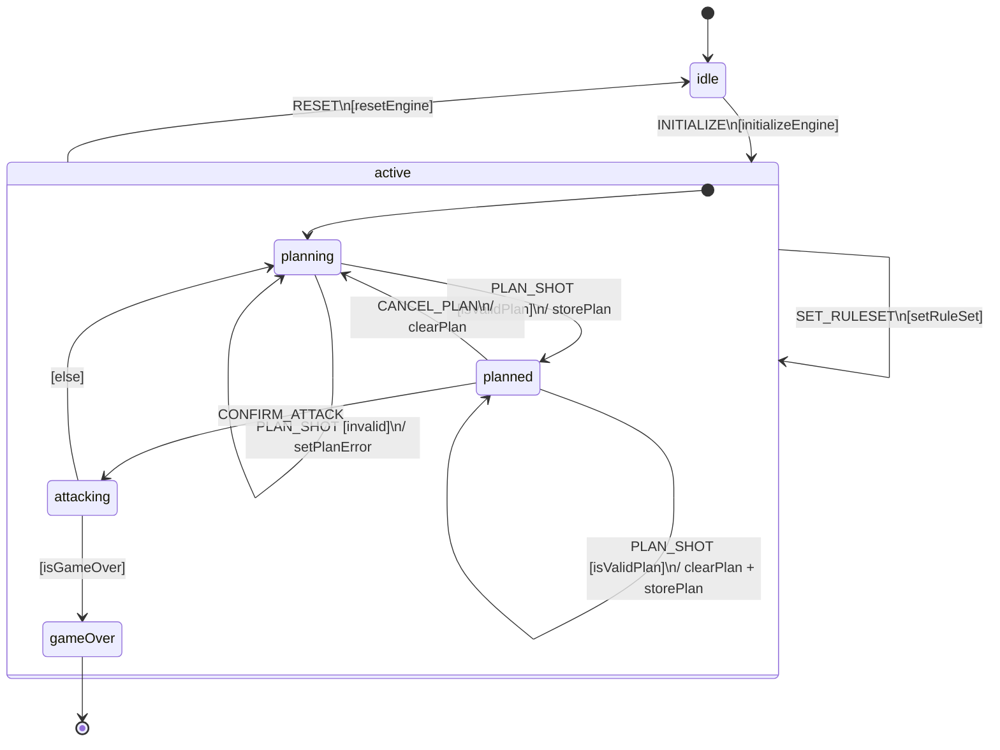
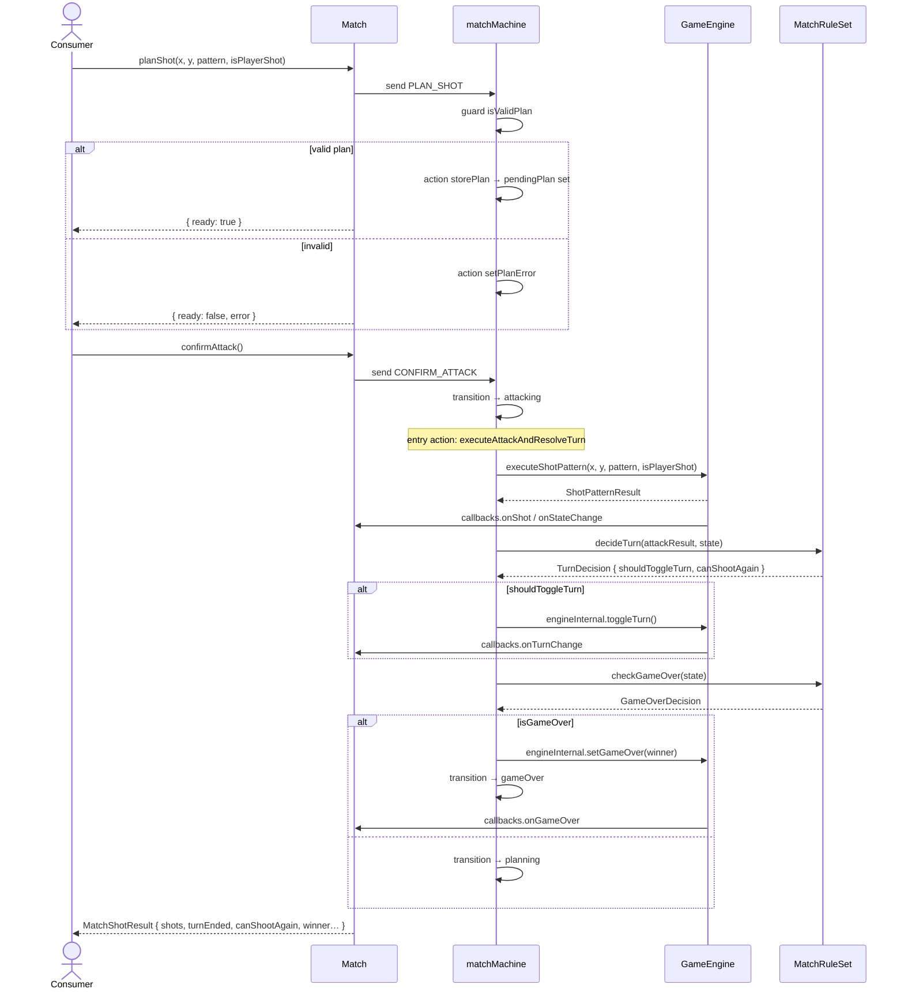
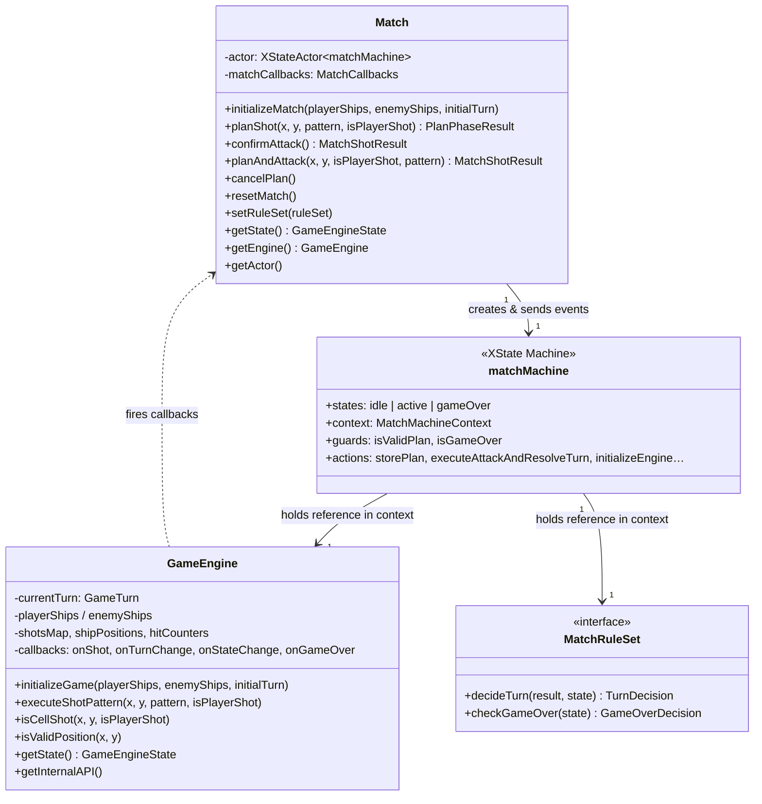

# Game Engine — Core Architecture

This document explains how the core of the game engine is structured, how the pieces relate to each other, and the complete turn lifecycle.

---

## 1. High-Level Architecture

The core is composed of three layers that communicate in one direction:


### Responsibilities

| Layer | Class / Module | Responsibility |
|---|---|---|
| Public API | `Match` | Wraps the XState actor; exposes simple methods (planShot, confirmAttack, planAndAttack, resetMatch…) and forwards callbacks to consumers. |
| State Orchestration | `matchMachine` | Owns the named states (`idle`, `active.planning`, `active.planned`, `active.attacking`, `gameOver`) and guards/actions that transition between them. |
| Pure Compute | `GameEngine` | Holds all mutable board data (shots maps, ship positions, hit counters, turn, game-over flag). Executes shot patterns and emits callbacks. |
| Rules | `MatchRuleSet` | Stateless object that decides, after each attack, whether to toggle the turn and whether the game is over. |

---

## 2. matchMachine — State Diagram



### State descriptions

| State | Description |
|---|---|
| `idle` | Machine created; no match in progress. Waiting for `INITIALIZE`. |
| `active.planning` | Waiting for the current player to choose a target cell. |
| `active.planned` | A valid plan is stored; waiting for confirmation or cancellation. |
| `active.attacking` | **Transient**: executes the attack + turn resolution atomically, then immediately transitions to `gameOver` or back to `planning`. |
| `gameOver` | Final state. The winner is read from `engine.getState().winner`. |

---

## 3. Turn Lifecycle — Sequence Diagram

Each turn is a three-phase cycle: **PLAN → ATTACK → TURN RESOLUTION**.



---

## 4. MatchRuleSet — Pluggable Rules

The `MatchRuleSet` interface makes turn management and game-over logic fully replaceable at runtime.


---

## 5. Class Relationships



---

## 6. React Integration

The engine is consumed in React through two hooks that sit above `Match`.


### Data flow in `useMatch`


---

## 7. Usage Example (without React)

```typescript
import { Match } from "./src/core/engine";
import { ClassicRuleSet } from "./src/core/engine/rulesets";

// 1. Create a match with a ruleset and callbacks
const match = new Match(
  { boardWidth: 10, boardHeight: 10 },
  {
    onShot: (shot, isPlayer) => console.log("Shot fired", shot, isPlayer),
    onTurnChange: (turn) => console.log("Turn changed to", turn),
    onGameOver: (winner) => console.log("Game over! Winner:", winner),
  },
  ClassicRuleSet,
);

// 2. Initialize with ship placements
match.initializeMatch(playerShips, enemyShips, "PLAYER_TURN");

// 3A. Two-phase attack (plan then confirm)
const plan = match.planShot(3, 4, SINGLE_SHOT, true);
if (plan.ready) {
  const result = match.confirmAttack();
  console.log(result.shots, result.turnEnded, result.canShootAgain);
}

// 3B. One-call shortcut
const result = match.planAndAttack(3, 4, true, SINGLE_SHOT);
```

---

## 8. Context Data Flow Summary


