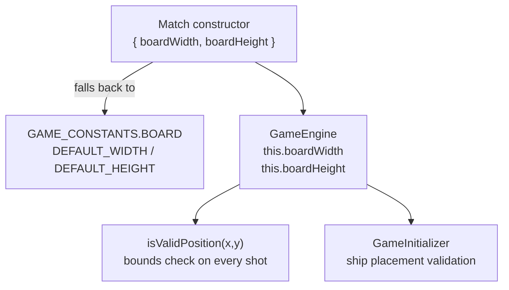
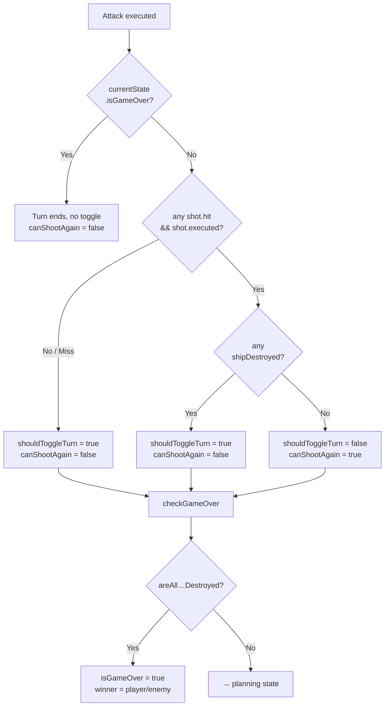

# Extension Guide — How to Add & Modify Engine Pieces

This guide answers **one question per topic**: _"I want to change X — what do I touch, in what order, and what are the rules?"_

---

## Table of Contents

1. [Board — Size & Constraints](#1-board--size--constraints)
2. [Ship Types — Adding & Modifying Variants](#2-ship-types--adding--modifying-variants)
3. [Shot Patterns — Adding & Modifying Patterns](#3-shot-patterns--adding--modifying-patterns)
4. [Game Rules — Adding & Modifying RuleSets](#4-game-rules--adding--modifying-rulesets)

---

## 1. Board — Size & Constraints

### What controls the board?

| Constant / Config | File | Default |
|---|---|---|
| `BOARD.DEFAULT_WIDTH` | `src/core/constants/game.ts` | `5` |
| `BOARD.DEFAULT_HEIGHT` | `src/core/constants/game.ts` | `5` |
| `BOARD.MIN_SIZE` | `src/core/constants/game.ts` | `3` |
| `BOARD.MAX_SIZE` | `src/core/constants/game.ts` | `30` |
| `GameConfig.boardWidth/boardHeight` | `src/core/types/config.ts` | (from above) |

`GameEngine` reads `boardWidth` and `boardHeight` from the `GameConfig` passed to its constructor. If they are omitted, it falls back to `GAME_CONSTANTS.BOARD.DEFAULT_WIDTH/HEIGHT`.

### Changing the default board size

Edit `src/core/constants/game.ts`:

```typescript
BOARD: {
  DEFAULT_WIDTH: 10,   // ← change here
  DEFAULT_HEIGHT: 10,  // ← change here
  MIN_SIZE: 3,
  MAX_SIZE: 30,
},
```

No other file needs to change — every consumer that omits `boardWidth`/`boardHeight` will pick up the new defaults automatically.

### Changing the board size per match (runtime)

Pass dimensions explicitly when constructing `Match` or `GameEngine`:

```typescript
const match = new Match(
  { boardWidth: 10, boardHeight: 10 },
  callbacks,
  ClassicRuleSet,
);
```

### Changing size limits (MIN / MAX)

`GameInitializer` validates board size against `MIN_SIZE` and `MAX_SIZE` before placing ships. Update those two constants in `game.ts` if you need a different valid range.



### Rules enforced by the engine

- Cells outside `[0, boardWidth-1] × [0, boardHeight-1]` are silently **skipped** (not errors) when a multi-cell shot pattern fires. The individual `shot.executed` flag will be `false` for those cells.
- `isValidPosition(x, y)` is a public method on `GameEngine` — call it before planning a shot to surface the error early.

---

## 2. Ship Types — Adding & Modifying Variants

### Single source of truth

All ship variants live in **`src/core/constants/ships.ts`**. Everything else derives from that file automatically:

```
ships.ts  →  SHIP_TEMPLATES
               ├─ game.ts         GAME_CONSTANTS.SHIPS.DEFAULT_COUNTS
               └─ calculations.ts generateShips()  →  GameInitializer
```

Nothing in `game.ts`, `config.ts`, `initializer.ts`, or `calculations.ts` needs to change when you add or remove a variant.

### The `ShipTemplate` type

```typescript
// src/core/constants/ships.ts
export interface ShipTemplate extends GameShip {
  defaultCount: number; // how many appear in a default game
}

// src/core/types/common.ts
export interface GameShip {
  coords: [number, number]; // always [0, 0] for templates (placed at runtime)
  width: number;            // columns occupied (horizontal span)
  height: number;           // rows occupied  (vertical span)
  shipId?: number;          // assigned at runtime by GameInitializer
}
```

### Adding a new ship variant

**Step 1 — Define the constant in `ships.ts`:**

```typescript
export const HUGE_SHIP: ShipTemplate = {
  coords: [0, 0],  // always [0,0] for templates
  width: 6,
  height: 1,
  defaultCount: 1,
};
```

**Step 2 — Register it in `SHIP_TEMPLATES`:**

```typescript
export const SHIP_TEMPLATES: Record<string, ShipTemplate> = {
  small:  SMALL_SHIP,
  medium: MEDIUM_SHIP,
  large:  LARGE_SHIP,
  xlarge: XLARGE_SHIP,
  huge:   HUGE_SHIP,   // ← add here
};
```

That's it. `DEFAULT_COUNTS` and ship generation update automatically.

### Modifying an existing variant

Change `width`, `height`, or `defaultCount` directly on the constant:

```typescript
export const MEDIUM_SHIP: ShipTemplate = {
  coords: [0, 0],
  width: 4,        // was 3 — now a 4-cell ship
  height: 1,
  defaultCount: 1, // was 2 — reduce fleet count
};
```

### 2D ships (width > 1 AND height > 1)

The engine fully supports rectangular ships. A 2×2 carrier:

```typescript
export const CARRIER_SHIP: ShipTemplate = {
  coords: [0, 0],
  width: 2,
  height: 2,
  defaultCount: 1,
};
```

`getShipCellsFromShip()` in `calculations.ts` computes every occupied cell as `[col, row]` pairs from the top-left corner, so a 2×2 ship correctly occupies four cells and requires four hits to sink.

### Overriding counts at runtime (without changing defaults)

Pass a `shipCounts` map when initializing a match through `GameInitializer`:

```typescript
// src/core/types/config.ts
export interface GameConfig {
  boardWidth: number;
  boardHeight: number;
  shipCounts: Record<string, number>; // key = variant name, value = count
  initialTurn: PlayerName | "random";
}
```

```typescript
// Use different counts for this game only
const config: GameConfig = {
  boardWidth: 10,
  boardHeight: 10,
  shipCounts: { small: 3, medium: 1, large: 0, xlarge: 1 },
  initialTurn: "PLAYER_TURN",
};
```

---

## 3. Shot Patterns — Adding & Modifying Patterns

### How patterns work

A `ShotPattern` is just a **center point + a list of offsets**. When a player fires at `(x, y)`, the engine fires one real shot for each offset at `(x + dx, y + dy)`. Shots that land outside the board or on already-shot cells are silently skipped (`executed: false`).

```typescript
// src/core/types/common.ts
export interface ShotPattern {
  id: string;
  name: string;
  description?: string;
  offsets: Array<{ dx: number; dy: number }>;
}
```

### Built-in patterns (src/core/constants/shotPatterns.ts)

| Constant | id | Cells | Shape |
|---|---|---|---|
| `SINGLE_SHOT` | `"single"` | 1 | · |
| `HORIZONTAL_LINE_SHOT` | `"horizontal-line"` | 3 | `─── ` |
| `VERTICAL_LINE_SHOT` | `"vertical-line"` | 3 | `│` |
| `CROSS_SHOT` | `"cross"` | 5 | `+` |
| `LARGE_CROSS_SHOT` | `"large-cross"` | 9 | extended `+` |
| `SQUARE_SHOT` | `"square"` | 9 | 3×3 block |
| `SMALL_SQUARE_SHOT` | `"small-square"` | 4 | 2×2 block |
| `DIAGONAL_X_SHOT` | `"diagonal-x"` | 5 | `✕` |
| `T_SHAPE_SHOT` | `"t-shape"` | 5 | `T` |
| `L_SHAPE_SHOT` | `"l-shape"` | 4 | `L` |

### Adding a new pattern

**Option A — Named constant (recommended for reuse):**

```typescript
// src/core/constants/shotPatterns.ts

/**
 * Arrow pattern — 5 shots pointing right
 * Pattern:
 *     X
 *   X X X
 *     X X
 */
export const ARROW_RIGHT_SHOT: ShotPattern = {
  id: "arrow-right",
  name: "Arrow Right",
  description: "5-shot arrow pointing right",
  offsets: [
    { dx: 0, dy: -1 }, // top
    { dx: 0, dy: 0 },  // center
    { dx: 1, dy: 0 },  // right
    { dx: 0, dy: 1 },  // bottom
    { dx: 1, dy: 1 },  // bottom-right
  ],
};

// Then register in SHOT_PATTERNS so getShotPattern() can find it:
export const SHOT_PATTERNS: Record<string, ShotPattern> = {
  // ...existing entries...
  "arrow-right": ARROW_RIGHT_SHOT,
};
```

**Option B — Inline / one-off (no registration needed):**

```typescript
import { createCustomPattern } from "./src/core/constants/shotPatterns";

const myPattern = createCustomPattern(
  "zigzag",
  "Zigzag",
  [
    { dx: -2, dy: 0 },
    { dx: -1, dy: 1 },
    { dx: 0, dy: 0 },
    { dx: 1, dy: 1 },
    { dx: 2, dy: 0 },
  ],
  "5-shot zigzag",
);

match.planAndAttack(5, 5, true, myPattern);
```

### Design rules for patterns

| Rule | Why |
|---|---|
| `id` must be unique | `getShotPattern(id)` uses it as a map key |
| `offsets` can be any size from 1 to N | No maximum — but large patterns on small boards will have many skipped shots |
| Out-of-bounds offsets are safe | The engine skips them, they don't count as a hit or miss |
| `{ dx: 0, dy: 0 }` is the player-chosen center | You are not required to include it, but most patterns do |

### Coordinate system

```
(0,0) ──► x (columns)
  │
  ▼
  y (rows)

dx > 0 → right   dx < 0 → left
dy > 0 → down    dy < 0 → up
```

---

## 4. Game Rules — Adding & Modifying RuleSets

### The `MatchRuleSet` interface

```typescript
// src/core/engine/rulesets.ts
export interface MatchRuleSet {
  name: string;
  description: string;

  /**
   * Called after every attack. Decides whether the turn ends and whether
   * the attacker can fire again.
   */
  decideTurn(
    attackResult: ShotPatternResult,
    currentState: GameEngineState,
  ): TurnDecision;

  /**
   * Called immediately after decideTurn. Decides whether the whole game
   * is finished and who won.
   */
  checkGameOver(state: GameEngineState): GameOverDecision;
}
```

### Return types

```typescript
export interface TurnDecision {
  shouldEndTurn: boolean;      // true  → turn is over
  shouldToggleTurn: boolean;   // true  → switch active player
  canShootAgain: boolean;      // true  → attacker fires again (same turn)
  reason: string;              // human-readable, useful for logging/UI
}

export interface GameOverDecision {
  isGameOver: boolean;
  winner: Winner;              // "player" | "enemy" | null
}
```

### Built-in rulesets

| Export | Behaviour |
|---|---|
| `ClassicRuleSet` | Hit (ship alive) → shoot again. Ship sunk or miss → turn switches. |
| `AlternatingTurnsRuleSet` | Every shot ends the turn, regardless of result. |
| `DefaultRuleSet` | Alias for `ClassicRuleSet`. |

### Adding a new ruleset

Implement the interface directly — no registration or base class required.

**Example: Forgiving Rules** — miss gives a second chance, only a ship sunk ends the turn:

```typescript
// src/core/engine/rulesets.ts  (or a separate file)

export const ForgivingRuleSet: MatchRuleSet = {
  name: "Forgiving",
  description: "Misses grant one extra shot; only sinking ends the turn",

  decideTurn(attackResult, currentState): TurnDecision {
    if (currentState.isGameOver) {
      return { shouldEndTurn: true, shouldToggleTurn: false, canShootAgain: false, reason: "Game over" };
    }

    const anyShipDestroyed = attackResult.shots.some(
      (s) => s.shipDestroyed && s.executed,
    );

    if (anyShipDestroyed) {
      return { shouldEndTurn: true, shouldToggleTurn: true, canShootAgain: false, reason: "Ship sunk - turn ends" };
    }

    // Hit OR miss → shoot again
    return { shouldEndTurn: false, shouldToggleTurn: false, canShootAgain: true, reason: "Shoot again" };
  },

  checkGameOver(state): GameOverDecision {
    if (state.areAllEnemyShipsDestroyed) return { isGameOver: true, winner: "player" };
    if (state.areAllPlayerShipsDestroyed) return { isGameOver: true, winner: "enemy" };
    return { isGameOver: false, winner: null };
  },
};
```

**Activate the ruleset:**

```typescript
// At construction time
const match = new Match(config, callbacks, ForgivingRuleSet);

// Or at runtime (replaces ruleset mid-game)
match.setRuleSet(ForgivingRuleSet);
```

### Key fields available in `GameEngineState`

`decideTurn` and `checkGameOver` both receive the current `GameEngineState`. The most useful fields:

| Field | Type | Description |
|---|---|---|
| `currentTurn` | `"PLAYER_TURN" \| "ENEMY_TURN"` | Who is attacking now |
| `isGameOver` | `boolean` | Whether the game has already ended |
| `winner` | `Winner` | `"player"`, `"enemy"`, or `null` |
| `areAllPlayerShipsDestroyed` | `boolean` | All player ships sunk |
| `areAllEnemyShipsDestroyed` | `boolean` | All enemy ships sunk |
| `playerShips` / `enemyShips` | `GameShip[]` | Current ship arrays |

### Decision flow reference



### Common customisation patterns

| Goal | What to change |
|---|---|
| Limit shots per turn (e.g. max 3) | Track a counter in a closure/class and toggle once limit is reached |
| Sudden-death (first hit wins) | `checkGameOver`: return `isGameOver: true` if any shot hit |
| Time-based turns | Implement outside the engine; call `confirmAttack()` when the timer expires |
| Different win condition (e.g. sink ONE ship) | `checkGameOver`: check if any individual ship is destroyed, not all |
