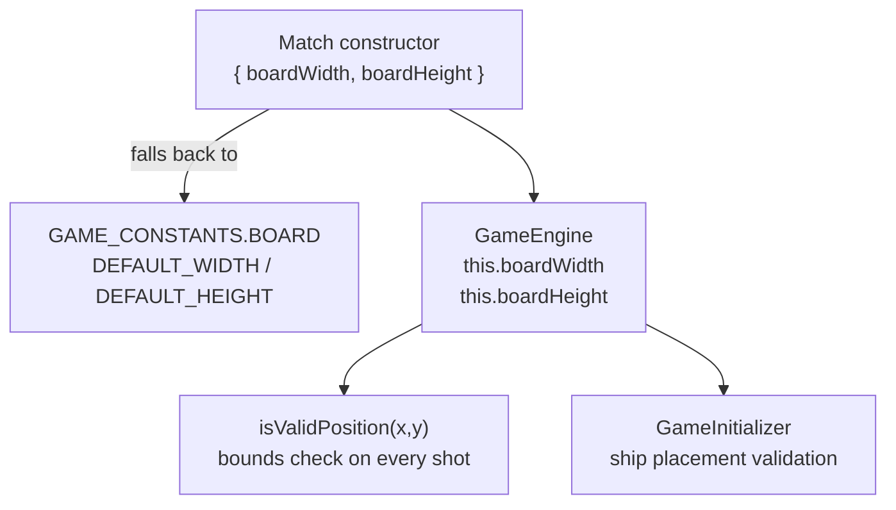
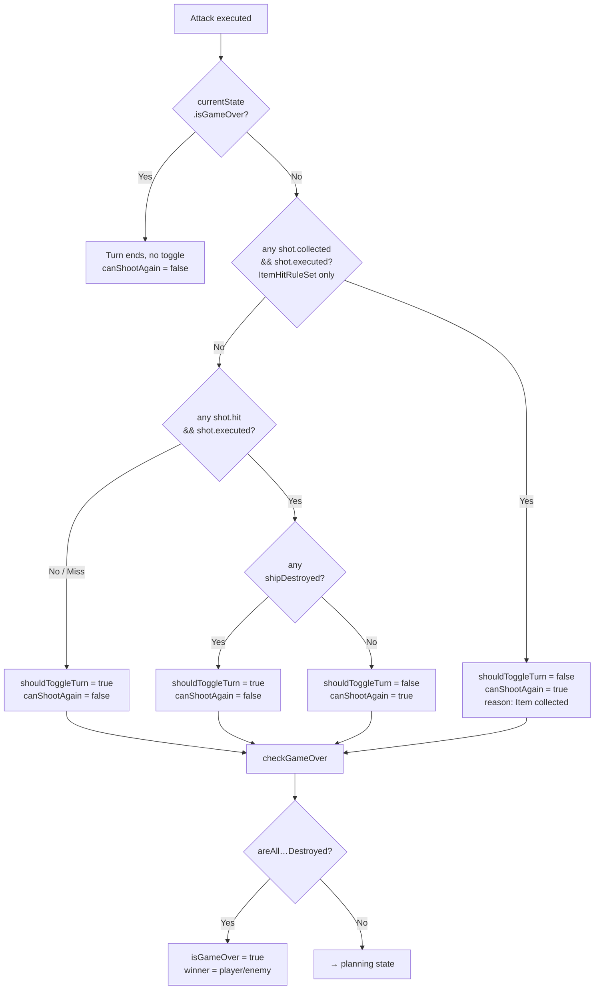
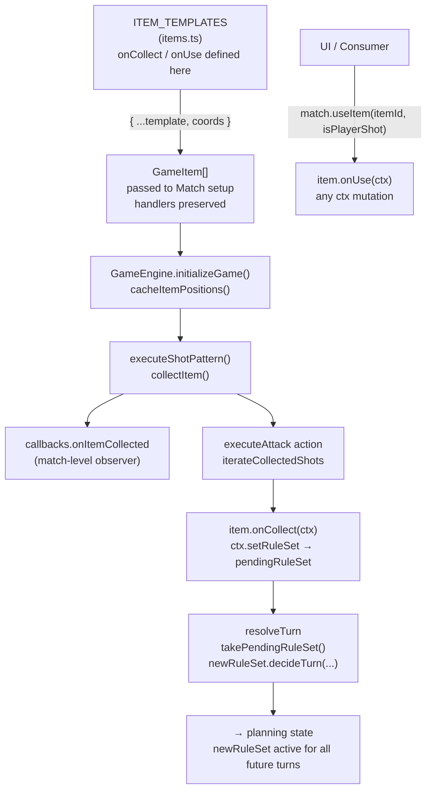

# Extension Guide — How to Add & Modify Engine Pieces

This guide answers **one question per topic**: _"I want to change X — what do I touch, in what order, and what are the rules?"_

---

## Table of Contents

1. [Board — Size & Constraints](#1-board--size--constraints)
2. [Ship Types — Adding & Modifying Variants](#2-ship-types--adding--modifying-variants)
3. [Shot Patterns — Adding & Modifying Patterns](#3-shot-patterns--adding--modifying-patterns)
4. [Game Rules — Adding & Modifying RuleSets](#4-game-rules--adding--modifying-rulesets)
5. [Items — Adding & Modifying GameItems](#5-items--adding--modifying-gameitems)

---

## 1. Board — Size & Constraints

### What controls the board?

| Constant / Config                   | File                         | Default      |
| ----------------------------------- | ---------------------------- | ------------ |
| `BOARD.DEFAULT_WIDTH`               | `src/core/constants/game.ts` | `5`          |
| `BOARD.DEFAULT_HEIGHT`              | `src/core/constants/game.ts` | `5`          |
| `BOARD.MIN_SIZE`                    | `src/core/constants/game.ts` | `3`          |
| `BOARD.MAX_SIZE`                    | `src/core/constants/game.ts` | `30`         |
| `GameConfig.boardWidth/boardHeight` | `src/core/types/config.ts`   | (from above) |

`GameEngine` reads `boardWidth` and `boardHeight` from the `GameConfig` passed to its constructor. If they are omitted, it falls back to `GAME_CONSTANTS.BOARD.DEFAULT_WIDTH/HEIGHT`.

### Changing the default board size

Edit `src/core/constants/game.ts`:

```typescript
BOARD: {
  DEFAULT_WIDTH: 10,   // ← change here
  DEFAULT_HEIGHT: 10,  // ← change here
  MIN_SIZE: 3,
  MAX_SIZE: 30,
},
```

No other file needs to change — every consumer that omits `boardWidth`/`boardHeight` will pick up the new defaults automatically.

### Changing the board size per match (runtime)

Pass dimensions explicitly when constructing `Match` or `GameEngine`:

```typescript
const match = new Match({
  setup: {
    playerShips,
    enemyShips,
    initialTurn: "PLAYER_TURN",
    config: { boardWidth: 10, boardHeight: 10 },
    ruleSet: ClassicRuleSet,
  },
  ...callbacks,
});
```

### Changing size limits (MIN / MAX)

`GameInitializer` validates board size against `MIN_SIZE` and `MAX_SIZE` before placing ships. Update those two constants in `game.ts` if you need a different valid range.


```mermaid
flowchart TD
    A["Match constructor\n{ boardWidth, boardHeight }"]
    A -->|"falls back to"| B["GAME_CONSTANTS.BOARD\nDEFAULT_WIDTH / DEFAULT_HEIGHT"]
    A --> C["GameEngine\nthis.boardWidth\nthis.boardHeight"]
    C --> D["isValidPosition(x,y)\nbounds check on every shot"]
    C --> E["GameInitializer\nship placement validation"]
```

### Rules enforced by the engine

- Cells outside `[0, boardWidth-1] × [0, boardHeight-1]` are silently **skipped** (not errors) when a multi-cell shot pattern fires. The individual `shot.executed` flag will be `false` for those cells.
- `isValidPosition(x, y)` is a public method on `GameEngine` — call it before planning a shot to surface the error early.

---

## 2. Ship Types — Adding & Modifying Variants

### Single source of truth

All ship variants live in **`src/core/constants/ships.ts`**. Everything else derives from that file automatically:

```
ships.ts  →  SHIP_TEMPLATES
               ├─ game.ts         GAME_CONSTANTS.SHIPS.DEFAULT_COUNTS
               └─ calculations.ts generateShips()  →  GameInitializer
```

Nothing in `game.ts`, `config.ts`, `initializer.ts`, or `calculations.ts` needs to change when you add or remove a variant.

### The `ShipTemplate` type

```typescript
// src/core/constants/ships.ts
export interface ShipTemplate extends GameShip {
  defaultCount: number; // how many appear in a default game
}

// src/core/types/common.ts
export interface GameShip {
  coords: [number, number]; // always [0, 0] for templates (placed at runtime)
  width: number; // columns occupied (horizontal span)
  height: number; // rows occupied  (vertical span)
  shipId?: number; // assigned at runtime by GameInitializer
}
```

### Adding a new ship variant

**Step 1 — Define the constant in `ships.ts`:**

```typescript
export const HUGE_SHIP: ShipTemplate = {
  coords: [0, 0], // always [0,0] for templates
  width: 6,
  height: 1,
  defaultCount: 1,
};
```

**Step 2 — Register it in `SHIP_TEMPLATES`:**

```typescript
export const SHIP_TEMPLATES: Record<string, ShipTemplate> = {
  small: SMALL_SHIP,
  medium: MEDIUM_SHIP,
  large: LARGE_SHIP,
  xlarge: XLARGE_SHIP,
  huge: HUGE_SHIP, // ← add here
};
```

That's it. `DEFAULT_COUNTS` and ship generation update automatically.

### Modifying an existing variant

Change `width`, `height`, or `defaultCount` directly on the constant:

```typescript
export const MEDIUM_SHIP: ShipTemplate = {
  coords: [0, 0],
  width: 4, // was 3 — now a 4-cell ship
  height: 1,
  defaultCount: 1, // was 2 — reduce fleet count
};
```

### 2D ships (width > 1 AND height > 1)

The engine fully supports rectangular ships. A 2×2 carrier:

```typescript
export const CARRIER_SHIP: ShipTemplate = {
  coords: [0, 0],
  width: 2,
  height: 2,
  defaultCount: 1,
};
```

`getShipCellsFromShip()` in `calculations.ts` computes every occupied cell as `[col, row]` pairs from the top-left corner, so a 2×2 ship correctly occupies four cells and requires four hits to sink.

### Overriding counts at runtime (without changing defaults)

Pass a `shipCounts` map when initializing a match through `GameInitializer`:

```typescript
// src/core/types/config.ts
export interface GameConfig {
  boardWidth: number;
  boardHeight: number;
  shipCounts: Record<string, number>; // key = variant name, value = count
  initialTurn: PlayerName | "random";
}
```

```typescript
// Use different counts for this game only
const config: GameConfig = {
  boardWidth: 10,
  boardHeight: 10,
  shipCounts: { small: 3, medium: 1, large: 0, xlarge: 1 },
  initialTurn: "PLAYER_TURN",
};
```

---

## 3. Shot Patterns — Adding & Modifying Patterns

### How patterns work

A `ShotPattern` is just a **center point + a list of offsets**. When a player fires at `(x, y)`, the engine fires one real shot for each offset at `(x + dx, y + dy)`. Shots that land outside the board or on already-shot cells are silently skipped (`executed: false`).

```typescript
// src/core/types/common.ts
export interface ShotPattern {
  id: string;
  name: string;
  description?: string;
  offsets: Array<{ dx: number; dy: number }>;
}
```

### Built-in patterns (src/core/constants/shotPatterns.ts)

| Constant               | id                  | Cells | Shape        |
| ---------------------- | ------------------- | ----- | ------------ |
| `SINGLE_SHOT`          | `"single"`          | 1     | ·            |
| `HORIZONTAL_LINE_SHOT` | `"horizontal-line"` | 3     | `─── `       |
| `VERTICAL_LINE_SHOT`   | `"vertical-line"`   | 3     | `│`          |
| `CROSS_SHOT`           | `"cross"`           | 5     | `+`          |
| `LARGE_CROSS_SHOT`     | `"large-cross"`     | 9     | extended `+` |
| `SQUARE_SHOT`          | `"square"`          | 9     | 3×3 block    |
| `SMALL_SQUARE_SHOT`    | `"small-square"`    | 4     | 2×2 block    |
| `DIAGONAL_X_SHOT`      | `"diagonal-x"`      | 5     | `✕`          |
| `T_SHAPE_SHOT`         | `"t-shape"`         | 5     | `T`          |
| `L_SHAPE_SHOT`         | `"l-shape"`         | 4     | `L`          |

### Adding a new pattern

**Option A — Named constant (recommended for reuse):**

```typescript
// src/core/constants/shotPatterns.ts

/**
 * Arrow pattern — 5 shots pointing right
 * Pattern:
 *     X
 *   X X X
 *     X X
 */
export const ARROW_RIGHT_SHOT: ShotPattern = {
  id: "arrow-right",
  name: "Arrow Right",
  description: "5-shot arrow pointing right",
  offsets: [
    { dx: 0, dy: -1 }, // top
    { dx: 0, dy: 0 }, // center
    { dx: 1, dy: 0 }, // right
    { dx: 0, dy: 1 }, // bottom
    { dx: 1, dy: 1 }, // bottom-right
  ],
};

// Then register in SHOT_PATTERNS so getShotPattern() can find it:
export const SHOT_PATTERNS: Record<string, ShotPattern> = {
  // ...existing entries...
  "arrow-right": ARROW_RIGHT_SHOT,
};
```

**Option B — Inline / one-off (no registration needed):**

```typescript
import { createCustomPattern } from "./src/core/constants/shotPatterns";

const myPattern = createCustomPattern(
  "zigzag",
  "Zigzag",
  [
    { dx: -2, dy: 0 },
    { dx: -1, dy: 1 },
    { dx: 0, dy: 0 },
    { dx: 1, dy: 1 },
    { dx: 2, dy: 0 },
  ],
  "5-shot zigzag",
);

match.planAndAttack(5, 5, true, myPattern);
```

### Design rules for patterns

| Rule                                           | Why                                                                          |
| ---------------------------------------------- | ---------------------------------------------------------------------------- |
| `id` must be unique                            | `getShotPattern(id)` uses it as a map key                                    |
| `offsets` can be any size from 1 to N          | No maximum — but large patterns on small boards will have many skipped shots |
| Out-of-bounds offsets are safe                 | The engine skips them, they don't count as a hit or miss                     |
| `{ dx: 0, dy: 0 }` is the player-chosen center | You are not required to include it, but most patterns do                     |

### Coordinate system

```
(0,0) ──► x (columns)
  │
  ▼
  y (rows)

dx > 0 → right   dx < 0 → left
dy > 0 → down    dy < 0 → up
```

---

## 4. Game Rules — Adding & Modifying RuleSets

### The `MatchRuleSet` interface

```typescript
// src/core/engine/rulesets.ts
export interface MatchRuleSet {
  name: string;
  description: string;

  /**
   * Called after every attack. Decides whether the turn ends and whether
   * the attacker can fire again.
   */
  decideTurn(
    attackResult: ShotPatternResult,
    currentState: GameEngineState,
  ): TurnDecision;

  /**
   * Called immediately after decideTurn. Decides whether the whole game
   * is finished and who won.
   */
  checkGameOver(state: GameEngineState): GameOverDecision;
}
```

### Return types

```typescript
export interface TurnDecision {
  shouldEndTurn: boolean; // true  → turn is over
  shouldToggleTurn: boolean; // true  → switch active player
  canShootAgain: boolean; // true  → attacker fires again (same turn)
  reason: string; // human-readable, useful for logging/UI
}

export interface GameOverDecision {
  isGameOver: boolean;
  winner: Winner; // "player" | "enemy" | null
}
```

### Built-in rulesets

| Export                    | Behaviour                                                                                                         |
| ------------------------- | ----------------------------------------------------------------------------------------------------------------- |
| `ClassicRuleSet`          | Hit (ship alive) → shoot again. Ship sunk or miss → turn switches.                                                |
| `AlternatingTurnsRuleSet` | Every shot ends the turn, regardless of result.                                                                   |
| `ItemHitRuleSet`          | Item collected → shoot again (takes priority). Hit (ship alive) → shoot again. Ship sunk or miss → turn switches. |
| `DefaultRuleSet`          | Alias for `ClassicRuleSet`.                                                                                       |

### Adding a new ruleset

Implement the interface directly — no registration or base class required.

**Example: Forgiving Rules** — miss gives a second chance, only a ship sunk ends the turn:

```typescript
// src/core/engine/rulesets.ts  (or a separate file)

export const ForgivingRuleSet: MatchRuleSet = {
  name: "Forgiving",
  description: "Misses grant one extra shot; only sinking ends the turn",

  decideTurn(attackResult, currentState): TurnDecision {
    if (currentState.isGameOver) {
      return {
        shouldEndTurn: true,
        shouldToggleTurn: false,
        canShootAgain: false,
        reason: "Game over",
      };
    }

    const anyShipDestroyed = attackResult.shots.some(
      (s) => s.shipDestroyed && s.executed,
    );

    if (anyShipDestroyed) {
      return {
        shouldEndTurn: true,
        shouldToggleTurn: true,
        canShootAgain: false,
        reason: "Ship sunk - turn ends",
      };
    }

    // Hit OR miss → shoot again
    return {
      shouldEndTurn: false,
      shouldToggleTurn: false,
      canShootAgain: true,
      reason: "Shoot again",
    };
  },

  checkGameOver(state): GameOverDecision {
    if (state.areAllEnemyShipsDestroyed)
      return { isGameOver: true, winner: "player" };
    if (state.areAllPlayerShipsDestroyed)
      return { isGameOver: true, winner: "enemy" };
    return { isGameOver: false, winner: null };
  },
};
```

**Activate the ruleset:**

```typescript
// At construction time
const match = new Match({
  setup: {
    playerShips,
    enemyShips,
    initialTurn: "PLAYER_TURN",
    config,
    ruleSet: ForgivingRuleSet,
  },
  ...callbacks,
});

// Or at runtime (replaces ruleset mid-game)
match.setRuleSet(ForgivingRuleSet);
```

### Key fields available in `GameEngineState`

`decideTurn` and `checkGameOver` both receive the current `GameEngineState`. The most useful fields:

| Field                        | Type                            | Description                        |
| ---------------------------- | ------------------------------- | ---------------------------------- |
| `currentTurn`                | `"PLAYER_TURN" \| "ENEMY_TURN"` | Who is attacking now               |
| `isGameOver`                 | `boolean`                       | Whether the game has already ended |
| `winner`                     | `Winner`                        | `"player"`, `"enemy"`, or `null`   |
| `areAllPlayerShipsDestroyed` | `boolean`                       | All player ships sunk              |
| `areAllEnemyShipsDestroyed`  | `boolean`                       | All enemy ships sunk               |
| `playerShips` / `enemyShips` | `GameShip[]`                    | Current ship arrays                |

### Decision flow reference


```mermaid
flowchart TD
    ATK[Attack executed] --> GO{currentState\n.isGameOver?}
    GO -- Yes --> NOOP[Turn ends, no toggle\ncanShootAgain = false]

    GO -- No --> ITEM{any shot.collected\n&& shot.executed?\nItemHitRuleSet only}
    ITEM -- Yes --> AGAIN2[shouldToggleTurn = false\ncanShootAgain = true\nreason: Item collected]

    ITEM -- No --> HIT{any shot.hit\n&& shot.executed?}

    HIT -- No / Miss --> MISS[shouldToggleTurn = true\ncanShootAgain = false]

    HIT -- Yes --> DEST{any\nshipDestroyed?}

    DEST -- Yes --> SUNK[shouldToggleTurn = true\ncanShootAgain = false]
    DEST -- No --> AGAIN[shouldToggleTurn = false\ncanShootAgain = true]

    MISS & SUNK & AGAIN & AGAIN2 --> GOR[checkGameOver]
    GOR --> FIN{areAll…Destroyed?}
    FIN -- Yes --> OVER[isGameOver = true\nwinner = player/enemy]
    FIN -- No --> PLAN[→ planning state]
```

### Common customisation patterns

| Goal                                         | What to change                                                              |
| -------------------------------------------- | --------------------------------------------------------------------------- |
| Limit shots per turn (e.g. max 3)            | Track a counter in a closure/class and toggle once limit is reached         |
| Sudden-death (first hit wins)                | `checkGameOver`: return `isGameOver: true` if any shot hit                  |
| Time-based turns                             | Implement outside the engine; call `confirmAttack()` when the timer expires |
| Different win condition (e.g. sink ONE ship) | `checkGameOver`: check if any individual ship is destroyed, not all         |

---

## 5. Items — Adding & Modifying GameItems

### What is a GameItem?

A `GameItem` is a collectible placed on a board. When all of its cells are shot the item is **fully collected**. Items are independent from ships — they occupy `ITEM` cells and never count as hits or misses on ships.

```typescript
// src/core/types/common.ts
export interface GameItem {
  /** Top-left position on the board. */
  coords: [number, number];
  /** Number of cells the item occupies (horizontal stripe). */
  part: number;
  /** Runtime index assigned automatically (0-based). */
  itemId?: number;
  /** Matches ItemTemplate.id — used for cross-board equalization. */
  templateId?: string;
  /**
   * Called once when all parts of this item have been fully collected.
   * Fires synchronously, before resolveTurn — so ruleset changes and turn
   * toggles take effect in the same attack cycle.
   */
  onCollect?: (ctx: ItemActionContext) => void;
  /**
   * Stored effect triggered manually from the UI via match.useItem().
   * The engine never calls this automatically.
   */
  onUse?: (ctx: ItemActionContext) => void;
}
```

`part` determines how many consecutive horizontal cells must be shot to fully collect the item. A `part: 1` item is collected with a single shot; `part: 3` requires three shots in a row.

---

### Item event handlers — `onCollect` and `onUse`

Both handlers receive an `ItemActionContext` that provides read access to the current game state and write access to every major engine surface.

```typescript
// src/core/types/common.ts
export interface ItemActionContext {
  item: GameItem;          // the item that triggered the event
  isPlayerShot: boolean;   // true = player collected it
  shot?: Shot;             // the shot that caused collection (undefined for onUse)
  currentTurn: GameTurn;

  // read-only snapshots
  playerShips: GameShip[];
  enemyShips: GameShip[];
  playerItems: GameItem[];
  enemyItems: GameItem[];
  playerCollectedItems: number[]; // items YOU collected (indices into enemyItems)
  enemyCollectedItems: number[];  // items OPPONENT collected (indices into playerItems)

  // mutations — all take effect immediately
  setPlayerShips(ships: GameShip[]): void;
  setEnemyShips(ships: GameShip[]): void;
  setPlayerItems(items: GameItem[]): void;
  setEnemyItems(items: GameItem[]): void;
  toggleTurn(): void;
  setRuleSet(ruleSet: unknown): void; // pass any MatchRuleSet
}
```

#### Timing guarantee for `onCollect`

`onCollect` fires **before** `resolveTurn` evaluates the ruleset. Any call to `ctx.setRuleSet()` inside `onCollect` is applied to the **same attack cycle** — the new ruleset's `decideTurn` is the one that determines whether the collector shoots again.

```
executeAttack  (matchMachine action)
  └─ executeShotPattern()
       └─ collectItem()
            └─ onItemCollected → matchCallbacks.onItemCollected()   ← consumer notified
  └─ for each shot where itemFullyCollected:
       └─ item.onCollect(ctx)            ← fires here, inside the machine action
            └─ ctx.setRuleSet(X)         ← stored synchronously in engine
resolveTurn  (matchMachine action)
  └─ takePendingRuleSet()                ← picks up X before decideTurn
  └─ X.decideTurn(...)                   ← new ruleset governs this turn ✓
  └─ context.ruleSet = X                 ← persisted for all future turns
```

#### `onUse` — UI-triggered effects

`onUse` is never called by the engine automatically. The UI triggers it via `match.useItem()`:

```typescript
// returns true if the handler was found and called
match.useItem(itemId, isPlayerShot);
```

- `itemId` — 0-based index of the item in the side's array.
- `isPlayerShot: true` → looks in `enemyItems` (items the player collected).
- `isPlayerShot: false` → looks in `playerItems` (items the enemy collected).

---

### Built-in item templates (`src/core/constants/items.ts`)

| Constant        | `id`              | `part` | `onCollect` effect                                 | `onUse` effect                    |
| --------------- | ----------------- | ------ | -------------------------------------------------- | --------------------------------- |
| `HEALTH_KIT`    | `"health_kit"`    | 1      | Switches to `ItemHitRuleSet` (hit-continuation)    | `toggleTurn()` — skip enemy turn  |
| `AMMO_CACHE`    | `"ammo_cache"`    | 1      | Switches to `ItemHitRuleSet` (hit-continuation)    | —                                 |
| `SHIELD_MODULE` | `"shield_module"` | 1      | Switches to `AlternatingTurnsRuleSet` (strips shoot-again) | `toggleTurn()` — cancel enemy turn |
| `RADAR_DEVICE`  | `"radar_device"`  | 3      | Clears all remaining items from the opponent's board | `toggleTurn()` — bonus shot     |

---

### Adding a new item template with handlers

**Step 1 — Define the constant in `items.ts`:**

```typescript
// src/core/constants/items.ts
import { ItemHitRuleSet } from "../engine/rulesets";

export const REPAIR_DRONE: ItemTemplate = {
  id: "repair_drone",
  title: "Repair Drone",
  description: "Grants hit-continuation on collect. Use to remove one enemy ship.",
  coords: [0, 0],
  part: 2,
  defaultCount: 1,

  onCollect(ctx) {
    // Grant shoot-again on hits for the rest of the match
    ctx.setRuleSet(ItemHitRuleSet);
  },

  onUse(ctx) {
    // Remove the last enemy ship from the board
    const remaining = ctx.enemyShips.slice(0, -1);
    ctx.setEnemyShips(remaining);
  },
};
```

**Step 2 — Register it in `ITEM_TEMPLATES`:**

```typescript
export const ITEM_TEMPLATES: Record<string, ItemTemplate> = {
  health_kit: HEALTH_KIT,
  ammo_cache: AMMO_CACHE,
  shield_module: SHIELD_MODULE,
  radar_device: RADAR_DEVICE,
  repair_drone: REPAIR_DRONE, // ← add here
};
```

That's it. `generateItems` will place the new variant automatically using the full template (including handlers).

> **Important:** `generateItems` spreads the full template object when placing items, so `onCollect` and `onUse` are always preserved. Never construct placed items manually with only `{ coords, part }` — always spread the template: `{ ...REPAIR_DRONE, coords: [x, y] }`.

---

### Placing items on the board at match start

```typescript
import { HEALTH_KIT, RADAR_DEVICE } from "./src/core/constants/items";

const enemyItems: GameItem[] = [
  { ...HEALTH_KIT, coords: [2, 3] },   // 1-cell item at (2,3)
  { ...RADAR_DEVICE, coords: [5, 7] }, // 3-cell item at (5,7),(6,7),(7,7)
];

const match = new Match({
  setup: {
    playerShips,
    enemyShips,
    initialTurn: "PLAYER_TURN",
    config: { boardWidth: 10, boardHeight: 10 },
    playerItems: [],
    enemyItems,
  },
});
match.initializeMatch();
```

### Placing items at runtime (after match start)

```typescript
const engine = match.getEngine();

engine.setEnemyItems([
  { ...HEALTH_KIT, coords: [0, 0] },
  { ...AMMO_CACHE, coords: [4, 4] },
]);

engine.setPlayerItems([{ ...SHIELD_MODULE, coords: [1, 1] }]);
```

> **Note:** `setPlayerItems` / `setEnemyItems` reset all hit counters and collected-item state for that board.

---

### Design rules for items

| Rule | Why |
| ---- | --- |
| Items occupy a **horizontal stripe** of `part` cells starting at `coords` | The engine iterates `coords[0]` to `coords[0] + part - 1` for hit detection |
| Items and ships **must not overlap** | Undefined behaviour — validate placement before `initializeMatch` |
| A shot on an item cell is **not** a ship hit | `shot.hit` stays `false`; `shot.collected` / `shot.itemFullyCollected` carry the result |
| `coords` in templates should always be `[0, 0]` | Actual position is set at placement time |
| `templateId` is optional but recommended | Enables cross-board equalization in multiplayer |
| Always spread the full template when placing: `{ ...TEMPLATE, coords }` | Preserves `onCollect` / `onUse` handlers |
| `onCollect` changes to `setRuleSet` apply to the **same** turn | Engine stores them in `pendingRuleSet` and `resolveTurn` flushes before `decideTurn` |
| `onUse` is never called automatically | The UI must call `match.useItem(itemId, isPlayerShot)` |

---

### Reacting to item collection in callbacks

The `Shot` object returned after each attack carries the collection result:

```typescript
export interface Shot {
  collected?: boolean;        // true if this shot collected a part of an item
  itemId?: number;            // 0-based index of the collected item
  itemFullyCollected?: boolean; // true if all parts are now collected
}
```

You can also react globally via the `onItemCollected` match callback. It fires synchronously inside `executeShotPattern` — i.e. before `item.onCollect` runs — so it receives the collection event first:

```typescript
const match = new Match({
  setup: { playerShips, enemyShips, initialTurn: "PLAYER_TURN", config },
  onItemCollected: (shot, item, isPlayerShot) => {
    console.log(`Item ${item.templateId} collected by ${isPlayerShot ? "player" : "enemy"}`);
  },
});
```

---

### Data flow


```mermaid
flowchart TD
    IT["ITEM_TEMPLATES\n(items.ts)\nonCollect / onUse defined here"]
    IT -->|"{ ...template, coords }"| PLACE["GameItem[]\npassed to Match setup\nhandlers preserved"]
    PLACE --> INIT["GameEngine.initializeGame()\ncacheItemPositions()"]
    INIT --> SHOT["executeShotPattern()\ncollectItem()"]
    SHOT --> CB_GLOBAL["callbacks.onItemCollected\n(match-level observer)"]
    SHOT --> EXEC["executeAttack action\niterateCollectedShots"]
    EXEC --> ON_COLLECT["item.onCollect(ctx)\nctx.setRuleSet → pendingRuleSet"]
    ON_COLLECT --> RESOLVE["resolveTurn\ntakePendingRuleSet()\nnewRuleSet.decideTurn(...)"]
    RESOLVE --> PLAN["→ planning state\nnewRuleSet active for all future turns"]

    UI["UI / Consumer"] -->|"match.useItem(itemId, isPlayerShot)"| ON_USE["item.onUse(ctx)\nany ctx mutation"]
```
